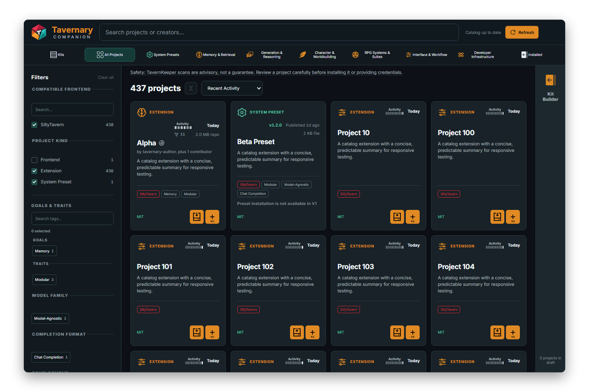
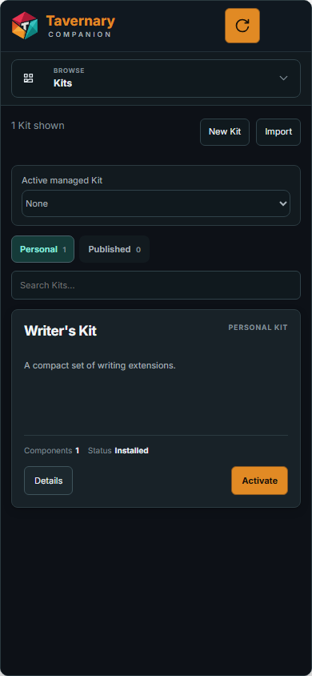
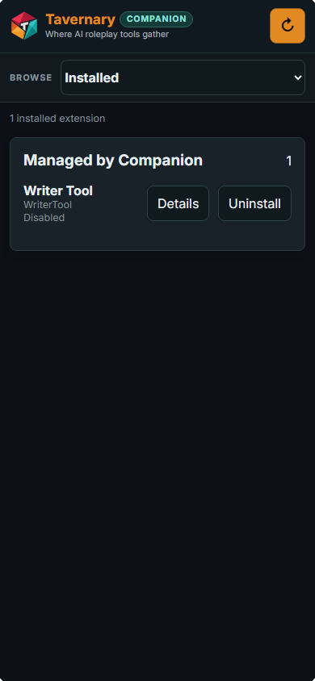
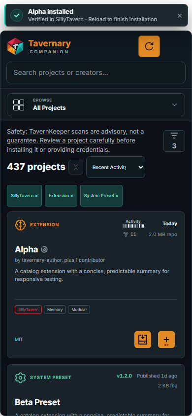

# Tavernary Companion

Tavernary Companion is a SillyTavern extension for finding, installing, updating, and organizing extensions from the Tavernary catalog.

It keeps the important choices in your hands. You can see what a project is, read its TavernKeeper information, choose a version, and review what will change before Companion acts.

> **Pre-alpha:** Companion is still being improved. Some catalog entries are browse-only, and the screens may change as the tool grows.

## How Companion connects to Tavernary.org

Companion can look familiar because it uses the same Tavernary catalog information, but it is not an HTML iframe or an embedded copy of Tavernary.org. It is a native SillyTavern extension whose screens are rendered inside SillyTavern.

When you refresh the catalog, Companion requests the public JSON catalog from [`tavernary.org/catalog/tavernary-catalog.json`](https://tavernary.org/catalog/tavernary-catalog.json). It reads that data to show Projects, search, filters, project details, install choices, and TavernKeeper information. It does not display the Tavernary.org website inside a frame or run the website as part of Companion.

**TavernKeeper** is the separate checking service. It examines a particular project version and provides evidence about that version. Tavernary.org publishes the relevant summary and report link in the catalog data; Companion displays that information so you can decide for yourself. Read [TavernKeeper and the catalog](docs/user/tavernkeeper-and-catalog.md) for the short version.

  

<em>Projects is your starting place: search, filter, read, and choose.</em>

## A quick tour

Companion has three main places. Think of them as three rooms in the same tool:

<table>
  <tr>
    <td width="33%" valign="top">
      <strong>Projects</strong> 
      Find extensions, presets, and other catalog entries. Search, filter, read the details, and install when the project is eligible.
    </td>
    <td width="33%" valign="top">
      <strong>Kits</strong> 
      Save groups of extensions that belong together. Create your own Kit, copy a Published Kit, or switch to a setup you already saved.
    </td>
    <td width="33%" valign="top">
      <strong>Installed</strong> 
      See what is present in this SillyTavern profile, check for updates, reload changes, and remove extensions you are allowed to manage.
    </td>
  </tr>
</table>

  
  
  

<em>The same three rooms fit on a small screen. The route picker sits below the header.</em>

## Your first five minutes

1. Open **Tavernary Companion** from SillyTavern.
2. Stay in **Projects** and search for something you want to try.
3. Read the card. Check the project type, summary, tags, license, and any TavernKeeper note.
4. Choose **Install** when it is available. The first install shows a short warning about third-party code.
5. If Companion asks which version you want, choose **Latest scanned** or **Latest from creator**. When the install finishes, open **Installed** and reload if Companion asks you to.

### Read the warning before you install

Extensions run code inside SillyTavern. Companion shows this disclosure before the first extension install so you understand what you are choosing.

  

<em>A scan gives you information. It does not promise that an extension is safe.</em>

### Choose the version yourself

Sometimes TavernKeeper checked one version, but the creator has published a newer one. Companion shows both choices instead of silently picking for you.

  

- **Latest scanned** is the exact version TavernKeeper looked at. The scan date and icon appear beside it.
- **Latest from creator** is the newest version published by the creator. Newer changes may not have been scanned yet.

Companion shows this chooser only when SillyTavern can install both exact versions. If the host has only its normal creator-latest install path, clicking **Install** proceeds directly without a version popup.

## Build a Kit when you find a setup you like

A Kit is a saved list of extensions. It does not copy extension files. It remembers the group you want so you can return to it later.

  

<em>Pick extensions in Projects, open the Kit Builder, then save the group with a name.</em>

You can also choose an Installed Kit to select its current members, add those members to a Personal Kit, or select a few extensions for a bulk action.

  
  

## What Companion controls

Companion is careful about ownership:

- It manages extensions that it installed and recorded.
- An extension you installed another way stays external. Adding it to a Kit does not transfer ownership.
- Companion will not silently replace local changes, switch a different repository, reset your work, roll back, or downgrade an extension.
- Preset installation is not available in this pre-alpha build.
- Bulk update is not available yet. You can still check and update extensions from **Installed** one at a time.
- TavernKeeper scans are evidence for a particular version, not a guarantee. Review unfamiliar projects before installing them or giving them credentials.

## Player guide

Start with the [Tavernary Companion player guide](docs/user/README.md), or jump directly to:

- [Getting started](docs/user/getting-started.md)
- [Browsing and installing](docs/user/browsing-and-installing.md)
- [Updating and removing extensions](docs/user/updating-extensions.md)
- [Managing Kits](docs/user/kits.md)
- [Checks and trust](docs/user/safety-and-trust.md)
- [Troubleshooting](docs/user/troubleshooting.md)
- [Words you’ll see](docs/user/words-to-know.md)
