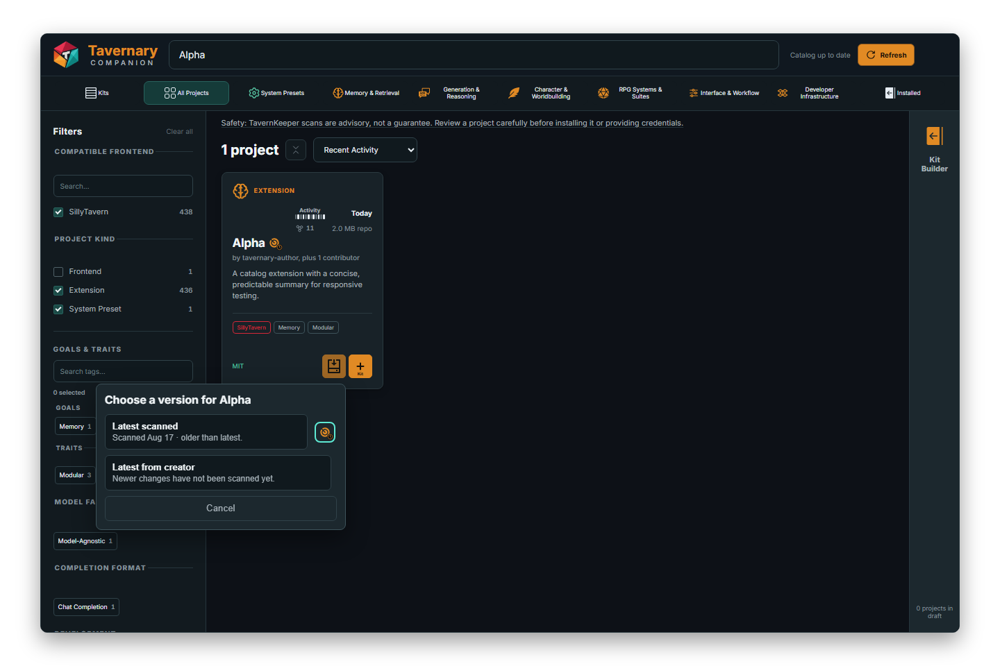

# Browsing and installing

Use **Projects** to find something, learn what it does, and decide whether you want to install it.

## Find projects

Use the search box for a project name, creator, tag, or word from the description.

Use **Filters** when you want to narrow the list. You can filter by things such as:

- compatible frontend;
- project kind, such as Extension or System Preset;
- goals and traits;
- model family;
- completion format;
- risk or installation state when those choices are available.

Use the sort menu to change the order. Active filters appear as small chips so you can see why a project is in the list. Remove a chip to widen the search again.

## Read a project card

A card can show:

- the project name and kind;
- a short description;
- the creator and project links;
- tags, license, activity, and version information;
- a TavernKeeper status or scan note;
- an action such as **Install**, **Uninstall**, **Add to Kit**, or **Manage in SillyTavern**.

Read the reason beside a disabled action. “Browse-only,” “Install contract unavailable,” or a safety warning each mean something different. If you want the full context, open the project details and follow the source or TavernKeeper link.

## Install a project

1. Search for the project.
2. Read the card and its warning, if there is one.
3. Choose **Install**.
4. Read the first-install disclosure about third-party code.
5. If two versions are offered, choose **Latest scanned** or **Latest from creator**.
6. Read the result. Companion verifies the installed state before it calls the install complete.

*Choose the version yourself. Latest scanned is the version TavernKeeper examined. Latest from creator may include newer changes that have not been scanned yet.*

If the two choices point to the same version, Companion skips the extra question. If only Latest from creator can be installed and its exact scan status is unknown, Companion shows a short note before continuing. If Latest scanned is no longer available, Companion stops instead of silently switching versions.

## Add projects to a Kit

You can start a Kit while browsing Projects:

1. Choose the **Kit** button on a project card.
2. Select more projects if you want.
3. Open the selection bar at the bottom.
4. Choose **Add to Kit**.
5. Pick a new Personal Kit or an existing one.
6. Review the staged list in the Kit Builder, then save it.

Adding a project to a Kit records your desired group. It does not install the project and does not transfer ownership of an extension that was installed outside Companion.

## Uninstall one extension

Open **Installed**, find the extension, choose **Uninstall**, and read the confirmation. Companion only removes extensions it is allowed to manage. An external extension stays under its existing owner.

## Uninstall several extensions

1. Open **Installed** and choose **Select**.
2. Select the extensions you want, or choose an Installed Kit to select its installed members.
3. Clear or add individual cards until the selection is right.
4. Choose **Uninstall** in the action bar.
5. Read the ownership and Kit impact summary.
6. Confirm only when the list is what you expect.

Companion removes the selected extensions one at a time and verifies each result. If some succeed and some fail, the successful removals stay removed. The failed extensions stay selected so you can choose **Retry failed**.

An affected Kit is not deleted. It may become **Partial**, **Missing**, or **Drifted** because some of its extensions are no longer present.

## Presets in this build

You can browse preset pages and read their details, but preset installation is not available in this pre-alpha build.
