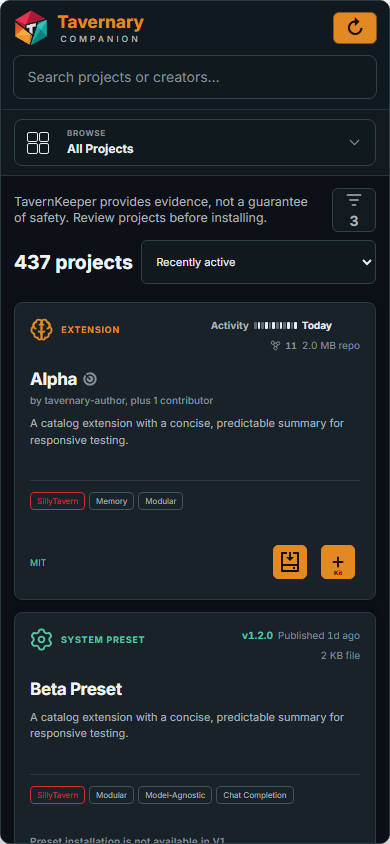

# Getting started

This is the shortest path from opening Companion to installing your first extension.

## 1. Open Companion

Open SillyTavern and choose **Tavernary Companion** from the extension menu. Companion opens inside SillyTavern, so you can keep your normal setup in view.

When the catalog is ready, you will start in **Projects**. If Companion already has a recent catalog saved, it may show that list while it checks for fresh information.

## 2. Learn the three places

- **Projects** is where you look for things.
- **Kits** is where you save groups of extensions.
- **Installed** is where you see what is really on this SillyTavern profile.

On a phone, tap the route picker under the header to move between them.

*Notice the search box, the **Browse** route picker, the filter button, and the project cards. The same controls are available on a wide screen too.*

## 3. Install one extension

1. Stay in **Projects**.
2. Search for a project or use the filters.
3. Read the project card. Look at its type, description, tags, license, and any TavernKeeper message.
4. Choose **Install** if the button is available.
5. Read the first-install warning. Choose **I understand** only if you want to continue.
6. If Companion asks you to choose a version, read both choices and pick the one you want.

Some projects are **browse-only**. You can read about them, but Companion cannot install them in this build. Presets are browse-only right now.

## 4. Wait for the result

Companion asks SillyTavern whether the extension was actually installed. A success message tells you that the result was verified. If a reload is needed, the message says so.

Choose **Reload now** when you are ready. You can also finish another action first and reload once at the end.

## 5. Find what you installed

Open **Installed**. Your extension should appear there with its current state and ownership:

- **Managed by Companion** means Companion installed and recorded it.
- **Installed outside Companion** means it was already there or was installed another way. Companion does not take ownership of it.

If the catalog is empty or an action is blocked, read [Troubleshooting](troubleshooting.md).

## What this version does not do yet

- It does not install presets.
- It does not silently choose between two different versions.
- It does not move ownership of extensions you installed yourself.
- It does not update every extension in one bulk action.
