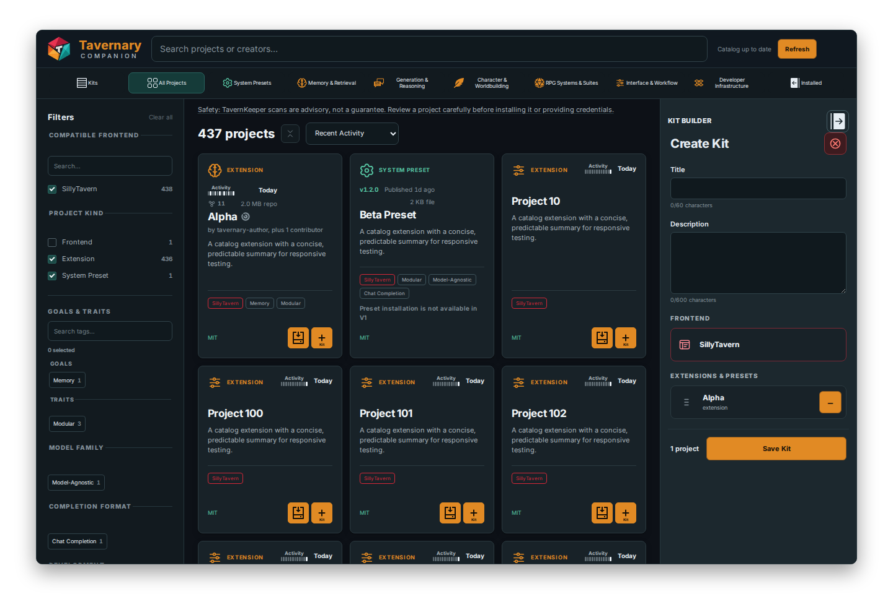
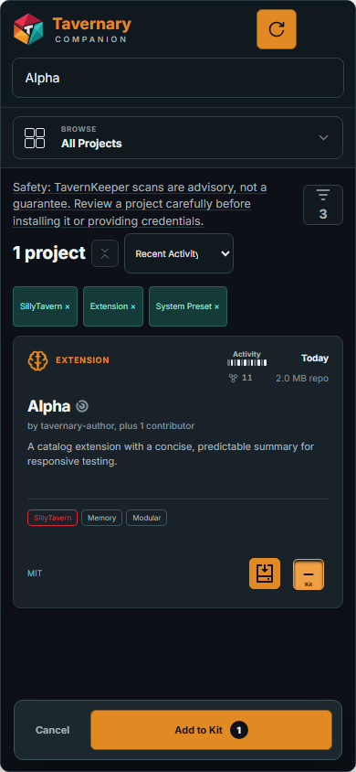

# Managing Kits

A Kit is a saved group of extensions. It helps you remember a setup for writing, roleplay, experiments, or any other activity.

A Kit is a list, not a copy of the extension files.

## Personal Kits and Published Kits

- **Personal Kit:** yours to create, rename, edit, duplicate, import, export, activate, and remove.
- **Published Kit:** a read-only Kit from the Tavernary catalog. You can inspect it, use it, or copy it into your Personal Kits.

Copying a Published Kit makes a local snapshot. Later catalog changes do not silently change your copy.

## Find a Kit

Use the **Personal** and **Published** tabs to choose which kind of Kit to browse. Search by Kit name or description. Published Kits also have filters and a sort menu so you can narrow a large list.

## Understand Kit status

These words describe different things:

| Status | Meaning |
| --- | --- |
| **Saved** | The Kit list exists, but it is not installed. |
| **Installed** | Companion has installed and recorded the Kit's eligible members. |
| **Active** | This Kit currently defines the enabled state for Companion-managed extensions. |
| **Partial** | Some extensions in the Kit are not installed. |
| **Missing** | None of the Kit's extensions are installed. |
| **Drifted** | The installed or enabled extensions no longer match the Kit's last verified state. |
| **Incomplete** | A member is unavailable, blocked, or cannot be used in the current setup. |

Removing a member does not delete the Kit. It changes the Kit's status so you can see that the saved list and the installed files are different.

## Make a Personal Kit

1. Open **Kits** and choose **New Kit**.
2. Give it a name and, if you want, a description.
3. Add eligible SillyTavern extensions.
4. Review context-only, unavailable, or externally installed members.
5. Save the Kit.

You can also begin in **Projects** by choosing the **Kit** button on a project card, or begin in **Installed** by selecting extensions and choosing **Add to Kit**.

*The Kit Builder lets you name the group, write a description, and review its members before saving.*

Adding an externally installed extension to a Kit records it as part of the desired group. It does not make Companion its owner.

## Apply or activate a Kit

1. Open the Kit details.
2. Choose **Install Kit** or **Activate Kit**.
3. Read the review screen. It lists extensions to install, keep, enable, disable, or remove.
4. Choose a version for any member that has more than one choice.
5. Read each warning and open the check link if you want more information.
6. Confirm the action.

Companion changes only extensions it manages. External extensions stay untouched. A completed Kit receipt lists each member and whether it finished, was kept, was left alone, or needs attention.

If the operation needs a reload, choose **Reload now** from the receipt. If one part fails, the receipt tells you which Kit is still active and offers **Try again** when the action can be retried.

## Select members from Installed

Open **Installed** and choose an Installed Kit. Companion selects the members from that Kit that are currently installed. You can select more Kits, clear individual cards, or cancel selection mode.

*The bottom action bar shows the number of selected projects and offers **Add to Kit**.*

Shared members are counted once. A selection is only a temporary choice; it does not change Kit membership until you save the Kit.

## Import and export

You can export a Personal Kit to a JSON file and import it on another account or SillyTavern install.

When you import, Companion previews the file first. It counts available, actionable, context-only, and unavailable members. An invalid file is rejected instead of being applied.

Importing creates a new Personal Kit. It does not overwrite one you already have.

## Uninstall a Kit

**Uninstall Kit** removes the installed Kit association and its managed members according to the review plan. It does not remove the saved Personal Kit definition.

If you only want to remove one or two extensions, use Installed selection instead. The Kit will remain saved and may show **Partial**, **Missing**, or **Drifted** afterward.
