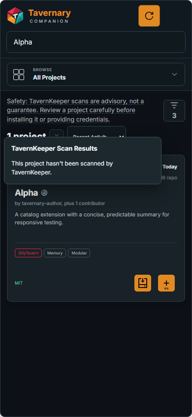
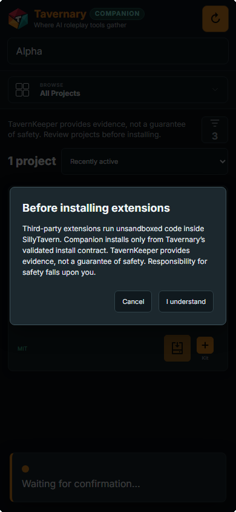

# Checks and trust

Companion gives you information before an extension changes your SillyTavern setup. You still decide what to install.

## What a TavernKeeper check means

TavernKeeper examines a specific version of a project. That check is useful evidence about that version. It is not a promise that the project is safe, friendly, useful, or free from every problem.

*A project can be unscanned. Read the result instead of treating an empty or gray state as approval.*

If a project has a scan, open the result when you want more detail. You can cancel any disclosure or warning before Companion changes the installation.

## Read the first-install disclosure

Before the first extension install, Companion explains that:

- extensions are made by third parties that Tavernary does not control;
- TavernKeeper checks one version and may miss problems;
- you should review a project before installing it.

Choose **I understand** only when you have read the message and want to continue. Choose **Cancel** when you want to stop and look at the project more closely.

## Latest scanned or Latest from creator?

When TavernKeeper checked an older version, the creator has published something newer, and SillyTavern can install exact commits, Companion gives you a choice:

- **Latest scanned:** the exact version TavernKeeper examined. It has a scan date and a scan-result icon you can hover, focus, click, or tap.
- **Latest from creator:** the newest version published by the creator. Its newer changes may not have been scanned yet.

Neither choice is automatically better. Choose the one that fits what you want to try.

Companion does not switch versions by itself. If Latest scanned is no longer available, it stops and lets you choose Latest from creator or cancel. On a standard host that can install only the creator’s current branch, Companion skips version selection and starts the normal install flow directly.

## Who controls an extension?

Companion keeps ownership visible:

- An extension installed by Companion is **managed by Companion**.
- An extension installed by hand or another tool is **installed outside Companion**.
- Adding an external extension to a Kit does not transfer ownership.
- Companion does not edit, remove, reset, or replace an external extension just because it appears in the catalog.
- Companion cannot uninstall itself from its own Installed list.

## When an update is blocked

Companion stops when the repository, branch, history, or local files do not match the catalog information it checked. This protects local work from a silent reset or downgrade.

Use SillyTavern's extension manager to inspect an extension that needs attention. Do not delete local changes just to make Companion accept the update.

## A careful habit

For an unfamiliar extension:

1. Read the project description and source link.
2. Read any TavernKeeper result or warning.
3. Try it in a test SillyTavern profile when you can.
4. Do not give an extension credentials until you understand why it needs them.
5. Stop using it if it behaves in a way you did not expect.
